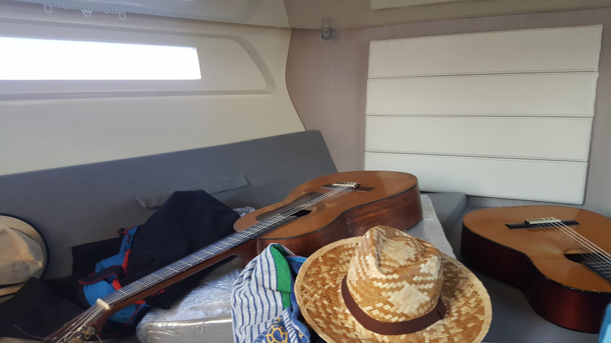
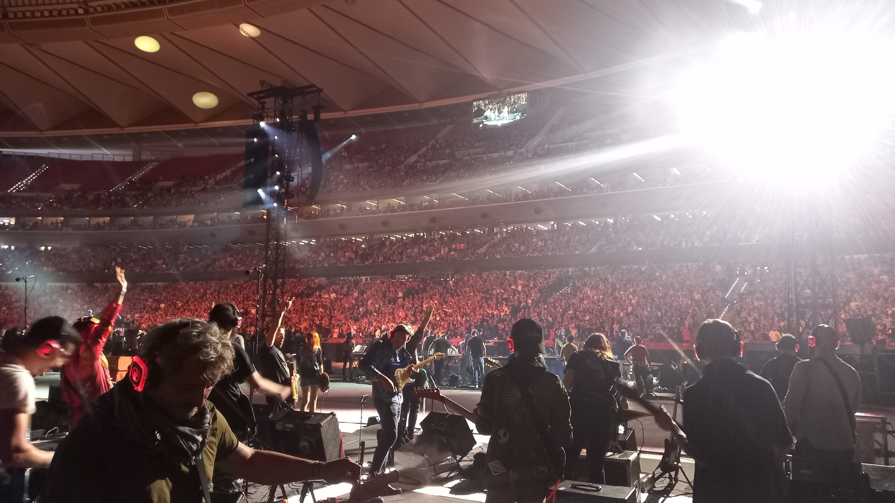

Outside of Astronomy, I'm a musician and play guitar! Together with some musician friends, I created the  **Greenfinch Sound Project**, based on original compositions: [official page](
https://greenfinchsoundproject.wordpress.com){:target="\_blank"}, [spotify](
https://open.spotify.com/artist/1j5VpGDvq8ChxCJHVFcNzz){:target="\_blank"}.

This music project is mentioned in the article **La banda de las estrellas: astrofísicos de Granada y músicos del universo**, for the Spanish magazine 'IDEAL': [link](https://www.ideal.es/culturas/banda-estrellas-astrofisicos-granada-20220228235559-nt.html?edtn=granada#vca=fixed-btn&vso=rrss&vmc=wh&vli=Culturas){:target="\_blank"}.

<!---
<h1 align="center">Some extra music projects:</h1>
-->

  <b>Some extra music projects:</b> 

- **FARaway Music Project**

{:target="\_blank"}

- **The Choir-on-a Video Project**

{:target="\_blank"}

- **Cívitas metropolitano Stadium Madrid 2023 - Rockin'1000**

{:target="\_blank"}

test