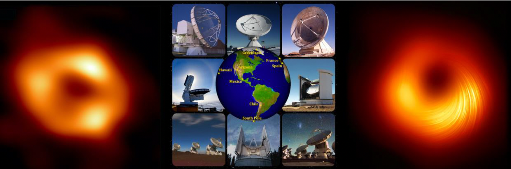
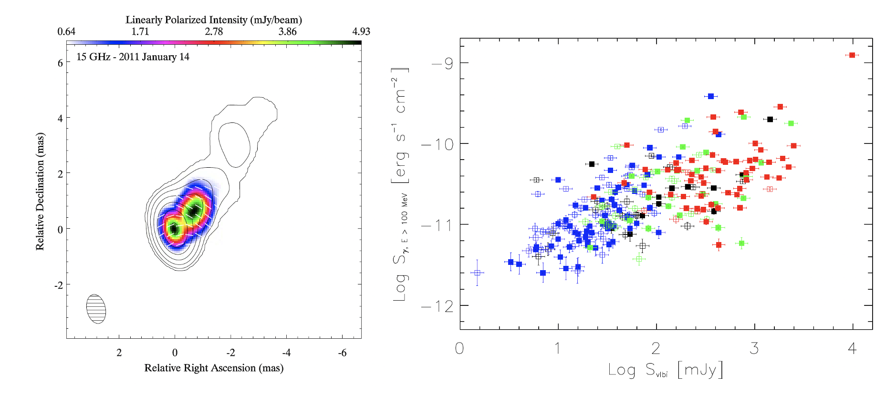
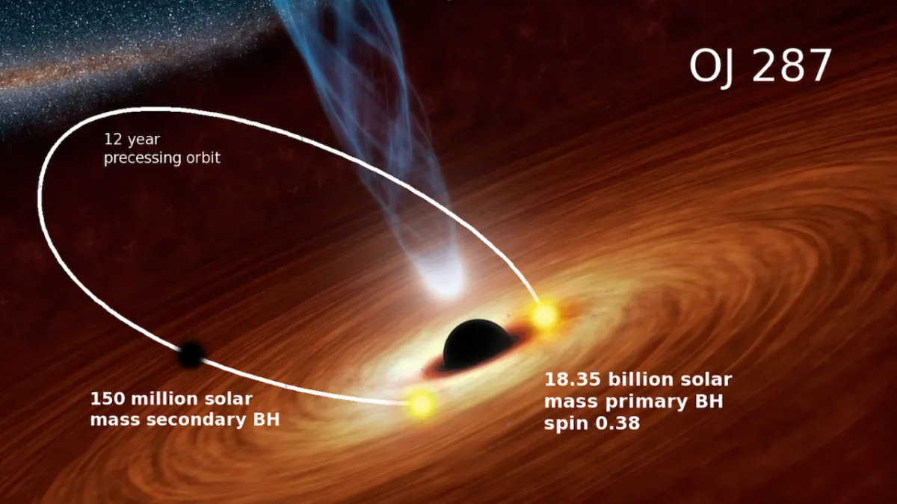
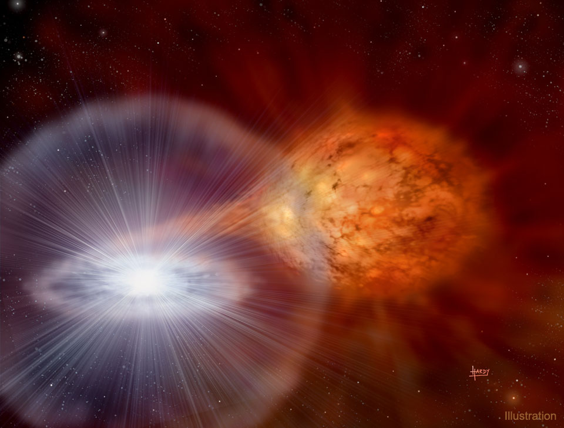



My research interests and scientific experience are mainly focused on the investigation of the statistical and physical
properties of **supermassive black holes (SMBHs)**, by means of the **very-long baseline interferometry (VLBI)** technique. 

If you are not familiar with all this, let me try to elaborate a bit more about SMBHs & VLBI.

**SMBHs** are those black holes with masses of the order of million to billion times the mass of the Sun and play a fundamental role in the cosmic evolution of their host galaxies. Basically, every massive galaxy in the universe hosts a SMBH at its center, including our own galaxy, the Milky Way, that hosts a 4.3 million solar masses SMBH, known as **Sagittarius A\* (SgrA\***). 

An extremely high angular resolution is required to access such compact regions, that can be achieved either by increasing the observing frequency either by using a very large telescope aperture. In this context, the most powerful tool is the so-called **VLBI technique**, that consists in using two or more radio telescopes, separated by a distance called baseline, which simultaneously collect the electromagnetic radiation, like a diffraction grating. Such array of telescopes mimics a high-resolution single virtual radio telescope with a diameter equivalent to the maximum baseline length (that for a ground-based array is represented the Earth diameter). 

# Black hole shadows and horizon-scale imaging

With the [Event Horizon Telescope](https://eventhorizontelescope.org/organization){:target="\_blank"} (EHT) Collaboration we recently obtained the first long-awaited horizon-scale image of SgrA*, located in the cetral regions of our Galaxy at a distance of ~27000 light-years from Earth. For this purpose, we assembled a global VLBI network operating at a wavelength of 1.3 mm (Fig.1 mid), that represents a virtual Earth-sized telescope with the highest angular resolution currently achievable from Earth. 

  
  <em>EHT image of SgrA* (left), EHT array (middle), EHT polarization image M87*(right).</em>

The EHT SgrA* horizon-scale image (Fig.1 left) reveals a morphology dominated by a bright and asymmetric ring emission (**“photon ring”**) surrounding a central and dark **“shadow”** cast by the black hole event horizon. The remarkable similarity of SgrA* and M87* (Fig.1 right) shadows, although their masses differ by ~3 orders of magnitude, indicates that lensed rings are universal features of black holes (independently of their mass).

For this work, I played an active role in the Imaging science working group, by taking part in all the steps of the imaging process. In particular, I provided several key contributions both to the data calibration and the analysis process, for which I received one of the [2022 EHT Early-Career awards](https://eventhorizontelescope.org/awards-eht){:target="\_blank"}. From one hand, I co-led the antenna gains team, in which we developed novel image evaluation metrics that helped us to characterize the instrumental fluctuations in the data and disentangle them from the intrinsic SgrA* variability. On the other hand, I co-led the parameter survey team, by producing several millions images with the standard deconvolution CLEAN algorithm with multiple computing clusters in Europe (IAA, MPIfR) and USA (Google cloud computing). 

# Active galactic nuclei and Relativistic jets 

In less than 10% of all galaxies in the universe, the central SMBH is actively accreting a large amount of surrounding material and produces luminosities ~3 orders of magnitude higher than in a typical galaxy. The central regions of such galaxies, are kwon as **Active Galactic Nuclei (AGNs)**, and in the most extreme cases the central SMBH can shoot a pair of collimated plasma jets at relativistic speeds that extend far beyond the host galaxy itself. The most powerful of those objects are the so-called **blazars**, with their relativistic jets closely aligned to our line-of-sight, that in the more extreme cases can produce photons up to tera-electovolt (TeV) energies (**TeV blazars**), and represent the ideal laboratory to investigate the particle acceleration mechanisms. 

  
  <em>Left: 15 GHz image of the relativistic jet in the TeV blazar Markarian 421 (image from Lico et al. 2014). Right: statistical correlation analysis plot between radio and gamma-ray emisison for different blazar populations (see Lico et al. 2017).</em>

However, since at radio frequencies TeV blazars are relatively low-luminosity sources (few tens of milli-Jy), their global properties are still elusive. Their jets are less variable than the mainstream blazar population, featuring stationary or sub-luminal jet components, and the inferred Doppler factors from radio frequency observations are far from the extreme values required for modeling the high energy emission (**Doppler factor crisis**). A possible explanation for this discrepancy is that the jet has an inhomogeneous structure transverse to the jet axis, with a fast inner spine (dominating the high energy emission) surrounded by a slower outer layer (dominating at lower frequencies). 

The details of formation, lunching and fueling process of such relativistic jets are not yet well understood. I devoted several works to the characterization of the statistical properties of blazars ([Lico et al. 2017a](https://ui.adsabs.harvard.edu/abs/2017A%26A...606A.138L/abstract){:target="\_blank"}) and of the parsec-scale physical properties of some of the most representative HSP objects ([Lico et al. 2012, ](https://ui.adsabs.harvard.edu/abs/2012A%26A...545A.117L/abstract){:target="\_blank"} [2014, ](https://ui.adsabs.harvard.edu/abs/2014A%26A...571A..54L/abstract){:target="\_blank"} [2016, ](https://ui.adsabs.harvard.edu/abs/2016A%26A...594A..60L/abstract){:target="\_blank"} [2017b,](https://ui.adsabs.harvard.edu/abs/2017MNRAS.469.1612L/abstract){:target="\_blank"} [2020](https://ui.adsabs.harvard.edu/abs/2020A%26A...634A..87L/abstract){:target="\_blank"}), with the final goal of determining their global and distinctive features.

# Super-massive binary black hole systems
SMBHs can also be found in binary systems, expected to form during hierarchical galaxy formation as a natural outcome of merger events. However, theory suggests that once two SMBHs get close enough, the stellar dynamical processes that drive the coalescence cease to be effective and prevent the merging. With the recent advance of mm-VLBI, as well as the space-VLBI technique, consisting in synchronizing a ground-based array together with a space satellite, we are further pushing the resolution limit trying to spatially resolve such binary systems and demonstrate their existence.

  
  <em>Artist's impression of the binary black hole system in OJ287 (CREDIT AAS 2018).</em>

I'm focusing part of my research efforts to this topic, by means of both mm-VLBI ([Lico et al. 2022](https://ui.adsabs.harvard.edu/abs/2022A%26A...658L..10L/abstract){:target="\_blank"}) and space-VLBI (Lico et al. in prep.) observations of one of the most reliable candidates, known as OJ287, at ~5 billion light-year from Earth. These observations provide the highest-fidelity reconstruction of the source jet base as well as the magnetic field structure at a resolution of a few tens of micro-arcsec.

# High-resolution imaging of the evolving bipolar outflows in symbiotic novae

Novae are astrophysical transient phenomena occurring in binary star systems, where a white dwarf accretes matter from a companion star, typically a main sequence star. As the accreted hydrogen-rich gas accumulates on the white dwarf’s surface, pressure and temperature build up until a thermonuclear explosion occurs, ejecting material through the stellar wind of the companion star at speeds of several thousands of km/sec. The interaction between the expanding shell and the companion wind generates an astrophysical shock, resulting in particle acceleration. As these accelerated particles cool down through interactions with matter and magnetic fields, they emit photons across multiple wavebands.
Some of these systems are classified as recurrent novae because they undergo multiple eruptions within human time-scales, as the companion star continuously feeds the white dwarf’s dense atmosphere after each ignition. 

  
  <em>Artist's impression of the RS Ophiuchi symbiotic nova system. (Credit: David A. Hardy & Ppparc)..</em>

To gain deeper insight into the physical mechanisms driving these explosive events and to track the expansion geometry of the ejected material, we recently conducted a multi-frequency radio VLBI monitoring with a global network of radio telescope, known as European VLBI Network (EVN), on one of the most well-known recurrent novae (RS Ophiuchi). We traced the evolving morphology of the expanding bipolar ejecta and characterized the physical conditions of the surrounding medium with unprecedented detail, providing one of the clearest views yet of how material is expelled and shaped during a nova explosion. All the details can be found in [Lico et al. 2024](https://arxiv.org/pdf/2407.05794){:target="\_blank"}, and in the science highlights of the EVN/JIVE Newsletter-Issue 71, May 2025 ([pag.6](https://www.evlbi.org/sites/default/files/shared/Newsletter/May%202025/71_NEWSLETTER_EVN_JIVE.pdf){:target="\_blank"} and [here](https://evlbi.org/evn-newsletter/may-2025/high-resolution-imaging-evolving-bipolar-outflows-symbiotic-novae-case-rs-ophiuchi-2021){:target="\_blank"}).

